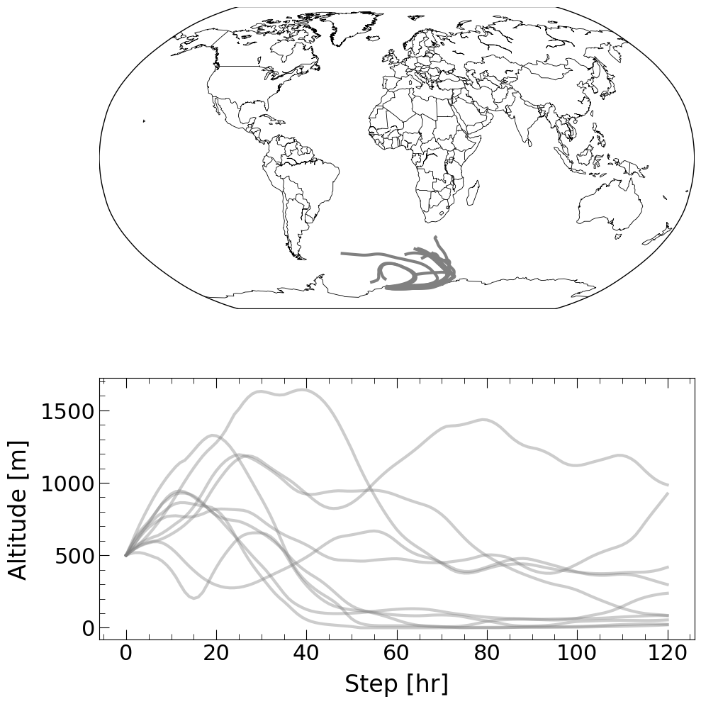

\newpage
\linenumbers

## Summary

## Statement of Need

## Current Functionality

1. **[HyTraj](../hytraj/__init__.py):**Higher level implementation of **Parallel Generation, reading and plotting** of Trajectories (**Recommended**).

2. **[HyGen](../hytraj/hygen.py):** Generation of Trajectories using various meteo datasets (**[NCEP and GDAS implemented](https://ready.arl.noaa.gov/archives.php)**).

3. **[HyControl](../hytraj/hygen.py):** Generation of control files for parallel trajectory generation afterwards. 

4. **[HyParallel](../hytraj/hygen.py):** Parallel generation of trajectories using control files produced using **HyControl**.

5. **[HyData](../hytraj/hyread.py):** Reading and binning trajectories data (NetCDF with xarray support).

6. **[HyCluster](../hytraj/hycluster.py):** Clustering of trajectories with KMeans using wavelet features.

7. **[HyHAC](../hytraj/hyagg.py):** Clustering of trajectories with Hierarchical Agglomerative Clustering (HAC) using various trajectory distance metric like [DTW, EDR, LCSS, SSPD, Frechet Distance, Hausdorf Distance](https://ieeexplore.ieee.org/document/7464920).

6. **[HyReceptor](../hytraj/hymodel.py):** [Single site Receptor Modeling](https://www.sciencedirect.com/science/article/abs/pii/S1352231002008865?via%3Dihub) ( both [weighted](https://www.sciencedirect.com/science/article/abs/pii/S1352231017303898?via%3Dihub) and unweighted):
    - Concentration weighted Trajectory (CWT)
    - Potential Source Contribution Function (PSCF) 
    - Residence Time Weighted Concentration (RTWC)

## Usage

```

import hytraj as ht
```

### Generate Trajectories

```
from hytraj import HyTraj

met_type = "ncep"
dates = pd.date_range("2010-02-01", freq="24H", end="2010-02-10")
hy = HyTraj(stations, height, run_time, working, metdir, outdir, met_type)
data = hy.run(dates, njobs=7)
hy.plot(data["Neumayer"], vertical="alt", show=True)
```


### Cluster Trajectories

#### KMeans Clustering using wavelet features

```
from hytraj import HyCluster

labels = HyCluster(data).fit(kmax=10, method='KMeans')
```

#### Hierarchical Agglomerative Clustering (HAC)

```
from hytraj import HyHAC

trj = HyHAC(data)
labels = trj.fit(nclus=4, metric='sspd')
trj.plot_dendrogram()
```


### Receptor Modeling

```
from hytraj import HyReceptor, HyData

station = 'South Pole'
data = HyData(files, stations).read()[station]
model = HyReceptor(ozone, data, station_name="South Pole")
cwt = model.calculate_cwt(weighted=False)
pscf = model.calculate_pscf(thresh=0.95)
rtwc = model.calculate_rtwc(normalise=True)
model.plot_map(rtwc, boundinglat=-25)
```

## Planned Enhancements

1. Support for more meteorology like **ERA5**.

2. **GUI:** Medium-term goal 

3. **Bayesian Inversion:** long-term goal

## Acknowledgements

We thank the ECMWF, GDAS and NCEP data providers for making them available for this study.

## References
